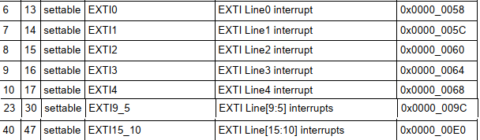

#### EXTI
External interrupts (EXTI) allow the system to respond to external events triggered on GPIO pins. The EXTI controller provides interrupt lines for each GPIO pin, enabling the MCU to detect changes such as rising edges, falling edges, or both on external signals.
#### EXTI Lines
Each GPIO pin in STM32F103 is connected to an EXTI line. The STM32F103 has up to 16 EXTI lines (EXTI0 to EXTI15), which map to GPIO pins as follows:

These EXTI lines allow different GPIO ports to share the same external interrupt line.
#### EXTI Trigger Conditions
- `Rising Edge`: When the signal transitions from `LOW` to `HIGH`.
- `Falling Edge`: When the signal transitions from `HIGH` to `LOW`.
- `Both Edges`: When the signal transitions on `both rising` and `falling` edges.
#### NVIC (Nested Vectored Interrupt Controller) Configuration
The NVIC is responsible for enabling and prioritizing interrupts. For each EXTI line, you must configure the NVIC to ensure the interrupt handler is called when the EXTI line triggers an event.

##### IRQ Number
`IRQNumber` is the unique identifier (interrupt request number) assigned to each peripheral or GPIO pin that can generate an interrupt in the STM32 microcontroller. Each interrupt source has its own IRQ number, which tells the NVIC (Nested Vectored Interrupt Controller) which interrupt to handle when an interrupt occurs.

##### Interrupt Priority Register
- `NVIC_IPRx`: Each register controls the priority of 4 interrupt sources. STM32 uses the upper 4 bits of each byte in these registers to represent the priority level, leaving the lower 4 bits unused.
- `Priority Level`: is a number, and lower numbers represent higher priority (i.e., they will be handled first). A priority level of 0 is the highest priority, and larger values represent lower priorities.

#### Interrupt Handler Function
When an interrupt occurs, the corresponding interrupt handler (IRQHandler) is executed. In this function, you check if the pending flag is set, clear it, and perform the necessary actions